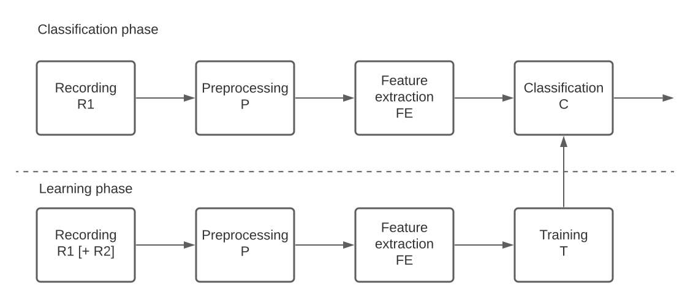
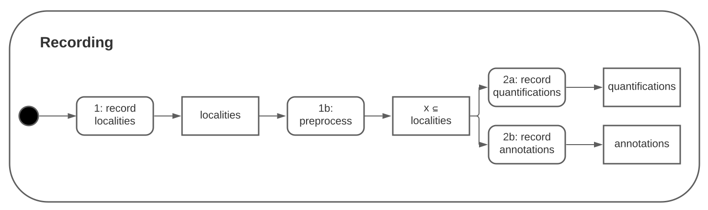

... IN PROGRESS

# BugFinder-Framework
This is a framework dedicated to automating finding bugs in source artefacts based on measurements 
and machine learning algorithms.

This framework´s main use case is researching correlations between measurements and bug occurrence.
It addresses reusability, modifiability and portability (adaptability, installibility and replaceability) 
of components needed to research correlations between source artefact measurements and bug occurrence. 

Different researchers should be able to exchange components of the bugfinder program and therefore
be able to distribute research among researchers world wide. With all needed components given
you should be able to automatically analyse code and find localities with high bug probability.

# Table of Contents  
- [BugFinder-Framework](#bugfinder-framework)
- [Table of Contents](#table-of-contents)
- [Introduction](#introduction)
  * [Recording by example - intuition](#recording-by-example---intuition)
  * [Preprocessing by example - intuition](#preprocessing-by-example---intuition)
  * [Feature extraction - intuition](#feature-extraction---intuition)
  * [Training - intuition](#training---intuition)
- [Quick start](#quick-start)
  * [1. Recording](#1-recording)
    + [1.1 Record localities](#11-record-localities)
    + [1.2 Preprocess localities](#12-preprocess-localities)
    + [1.3 Quantify localities](#13-quantify-localities)
    + [1.4 Annotate localities](#14-annotate-localities)
  * [2. Preprocessing](#2-preprocessing)
  * [3. Feature Extraction](#3-feature-extraction)
  * [4. Training](#4-training)
- [Usage: Researcher](#usage--researcher)
- [Component realisations available](#component-realisations-available)
  * [Recording](#recording)
    + [LocalityRecorder (and therefore localities)](#localityrecorder--and-therefore-localities-)
    + [LocalityPreprocessors](#localitypreprocessors)
    + [Quantifier](#quantifier)
    + [Annotator](#annotator)
  * [Preprocessor](#preprocessor)
  * [Feature Extractor](#feature-extractor)
  * [Trainer](#trainer)
  * [Classifier](#classifier)
<small><i><a href='http://ecotrust-canada.github.io/markdown-toc/'>Table of contents generated with markdown-toc</a></i></small>

# Introduction
The whole process beginning with recording until classification of localities is designed with a
standard machine learning pipeline:

Researchers want to develop or use others´ implementation of the components needed to realise
this machine learning pipeline.

## Recording by example - intuition
All used examples in the following documentations are already implemented and ready to use. 

Record all features. F.e. record all Lines Of Code for each file in each Commit.

1. You first need to record all localities, CommitPaths, of a repository. 
A CommitPath is a path in a commit.

2. After that you can preprocess your CommitPaths. For example filtering all the paths you do not
want to quantify, like .txt-, .md-files and only keep CommitPaths with paths in src ending with .ts.

3. After that you want to quantify your CommitPaths, f.e. with the SonarQubeQuantifier. Therefore getting 
a map of CommitPaths to SonarQubeMeasurements.

4. You might also want to annotate your localities so that you have labels needed 
for suppervised learning algorithms. You can label your CommitPaths with analyzing the Commit-message
for semantic key words like "bug, fix, error, fail" indicating a correction of a bug.

Now you have a database of localities, quantifications (features) and annotations (classes).

## Preprocessing by example - intuition
Preprocess your data from the recording phase.

F.e.: Find the last 3 changes of a CommitPath with a bug indicating commit message. Those changes
are localities by them self: CommitPaths. Now you can analyse the changes made before a CommitPath
got a bug. F.e. the max. added Lines Of Code in a change. 

In the training phase you might find statistical correlation between the amount of lines of codes 
added in one single change and the likelyhood of a bug beeing fixed later in that file. Therefore
indicating a bug added in that file.

## Feature extraction - intuition
t.b.a.

## Training - intuition
t.b.a.

# Quick start
The best way to start is to clone the examples repository and make changes there.

## 1. Recording
For each step of the pipeline a process will be started.

This framework uses [inversifyjs](https://github.com/inversify/InversifyJS) to inject dependencies.
For each process you should have a configuration file and a main file.

    npm i bugfinder-framework

### 1.1 Record localities
with

    $LOCALITY_CLASS: A class which implements the Locality interface.
    $LOCALITY_RECORDER_CLASS: A class which implements the LocalityRecorder interface.
        Generics: $LOCALITY_CLASS
    $DB_CLASS: A class which implements the db interface.
        Generics: $LOCALITY_CLASS, any, any
inversify.config.ts:

    import {LOCALITY_A_TYPES, DB, LocalityRecorder, LocalityRecordingFactory} 
        from "bugfinder-framework";
    import {localityAContainer} from "bugfinder-framework-defaultcontainer";
    
    const container = localityAContainer;
    
    // binding necessary types for locality recording process  
    container.bind<LocalityRecorder< $LOCALITY_CLASS >>(LOCALITY_A_TYPES.localityRecorder)
        .to( $LOCALITY_RECORDER_CLASS )
    container.bind<DB< $LOCALITY_CLASS, any, any> >(LOCALITY_A_TYPES.db).to( $DBCLASS )
    container.bind< LocalityRecordingFactory< $LOCALITY_CLASS >(
        LOCALITY_A_TYPES.localityRecordingFactory).to(LocalityRecordingFactory)
    
    // [optional binding the packages you are using as localityRecorder and DB might need:]
    // ...

main.ts:

    import "reflect-metadata";
    import {container} from "./inversify.config"    
    const factory = container.get<LocalityRecordingFactory< $LOCALITY_CLASS >(
        LOCALITY_A_TYPES.localityRecordingFactory)

    const db = factory.createDB()
    const recorder = factory.createLocalityRecorder()
    
    const localities = await recorder.getLocalities()
    await db.writeLocalities(localities, "Localities")
        
### 1.2 Preprocess localities
with

    $LOCALITY_CLASS: A class which implements the Locality interface.
    $LOCALITY_PREPROCESSOR_CLASS: A class which implements the LocalityPreprocessor interface.
        Generics: $LOCALITY_CLASS
    $DB_CLASS: A class which implements the db interface.
        Generics: $LOCALITY_CLASS, any, any
    
inversify.config.ts:

    import {LOCALITY_B_TYPES, DB, LocalityPreprocessor, LocalityPreprocessingFactory} 
        from "bugfinder-framework";
    import {localityBContainer} from "bugfinder-framework-defaultcontainer";
    
    const container = localityBContainer;
    
    // binding necessary types for locality preprocessing process  
    container.bind<LocalityPreprocessor< $LOCALITY_CLASS >>(LOCALITY_B_TYPES.localityPreprocessor)
        .to( $LOCALITY_PREPROCESSOR_CLASS )
    container.bind<DB< $LOCALITY_CLASS, any, any> >(LOCALITY_B_TYPES.db).to( $DBCLASS )
    container.bind< LocalityRecordingFactory< $LOCALITY_CLASS >(
        LOCALITY_B_TYPES.localityPreprocessingFactory).to(LocalityRecordingFactory)
    
    // [optional binding the packages you are using as localityRecorder and DB might need:]
    // ...

main.ts:

    import "reflect-metadata";
    import {container} from "./inversify.config"    
    const factory = container.get<LocalityPreprocessingFactory< $LOCALITY_CLASS >(
        LOCALITY_B_TYPES.localityPreprocessingFactory)

    const db = factory.createDB()
    const preprocessor = factory.createLocalityPreprocessor()
    
    const localities = await db.readLocalities("Localities")
    const processedLocalities = await preprocessor.preprocess(localities)
    await db.writeLocalities(processedLocalities, "ProcessedLocalities")
    
### 1.3 Quantify localities
with

    $LOCALITY_CLASS: A class which implements the Locality interface. 
    $QUANTIFIER_CLASS: A class which implements the Quantifier interface.
        Generics: $LOCALITY_CLASS, $QUANTIFICATION_CLASS
    $DB_CLASS: A class which implements the db interface. 
        Generics: $LOCALITY_CLASS, any, $MEASUREMENT_CLASS
    $QUANTIFICATION_CLASS: A class. F.e. a class which contains der linesOfCode measured 
        by your Quantifier
    
export interface Quantifier<L extends Locality, Quantification> 
inversify.config.ts:

    import {QUANTIFIER_TYPES, DB, Quantifier, QuantificationFactory} from "bugfinder-framework";
    import {quantifierContainer} from "bugfinder-framework-defaultcontainer";
    
    const container = quantifierContainer;
    
    // binding necessary types for locality quantification process  
    container.bind<Quantifier< $LOCALITY_CLASS >>(QUANTIFIER_TYPES.quantifier)
        .to( $QUANTIFIER_CLASS )
    container.bind<DB< $LOCALITY_CLASS, any, $QUANTIFICATION_CLASS > >(QUANTIFIER_TYPES.db)
        .to( $DBCLASS )
    container.bind< QuantificationFactory< $LOCALITY_CLASS >(
        QUANTIFIER_TYPES.quantificationFactory).to(QuantificationFactory)
    
    // [optional binding the packages you are using as localityRecorder and DB might need:]
    // ...

main.ts:

    import "reflect-metadata";
    import {container} from "./inversify.config"    
    const factory = container.get<QuantificationFactory< $LOCALITY_CLASS >(
        QUANTIFIER_TYPES.quantificationFactory)

    const db = factory.createDB()
    const quantifier = factory.createQuantifier()
    
    const localities = await db.readLocalities("ProcessedLocalities")
    const quantifications = await quantifier.quantify(localities)
    await db.writeQuantifications(quantifications, "Quantifications")
### 1.4 Annotate localities
with

    $LOCALITY_CLASS: A class which implements the Locality interface. 
    $ANNOTATOR_CLASS: A class which implements the Quantifier interface.
        Generics: $LOCALITY_CLASS, $ANNOTATION_CLASS
    $DB_CLASS: A class which implements the db interface. 
        Generics: $LOCALITY_CLASS, $ANNOTAION_CLASS, any
    $ANNOTATION_CLASS: A class. F.e. a class which contains a boolean bug which indicates
        whethe the locality has a bug or not.
inversify.config.ts:

    import {ANNOTATION_TYPES, DB, Annotator, AnnotationFactory} from "bugfinder-framework";
    import {annotatorContainer} from "bugfinder-framework-defaultcontainer";
    
    const container = annotatorContainer;
    
    // binding necessary types for locality quantification process  
    container.bind<Annotator< $LOCALITY_CLASS >>(ANNOTATOR_TYPES.annotator)
        .to( $ANNOTATOR_CLASS )
    container.bind<DB< $LOCALITY_CLASS, $ANNOTATION_CLASS, any > >(ANNOTATOR_TYPES.db).to( $DBCLASS )
    container.bind< AnnotationFactory< $LOCALITY_CLASS >(
        ANNOTATOR_TYPES.annotationFactory).to(AnnotationFactory)
    
    // [optional binding the packages you are using as localityRecorder and DB might need:]
    // ...

main.ts:

    import "reflect-metadata";
    import {container} from "./inversify.config"    
    const factory = container.get<AnnotationFactory< $LOCALITY_CLASS >(
        ANNOTATOR_TYPES.annotationFactory)

    const db = factory.createDB()
    const annotator = factory.createAnnotator()
    
    const localities = await db.readLocalities("ProcessedLocalities")
    const annotations = await annotator.annotate(localities)
    await db.writeAnnotations(annotations, "Annotations")

## 2. Preprocessing

## 3. Feature Extraction

## 4. Training

t.b.a

# Usage: Researcher
t.b.a.

# Component realisations available
You can find different components realisations open source on github and npm.
Search for bugfinder-*
## Shared
### DB
- [Commit-MongoDB](https://www.npmjs.com/package/bugfinder-commit-db-mongodb)
- [CommitPath-MongoDB](https://www.npmjs.com/package/bugfinder-commitpath-db-mongodb)
## Recording
### LocalityRecorder (and therefore localities)
npm search: bugfinder-localityrecorder-*
- [CommitPath](https://www.npmjs.com/package/bugfinder-localityrecorder-commitpath)
- [Commit](https://www.npmjs.com/package/bugfinder-localityrecorder-commit)

### LocalityPreprocessors
npm search: bugfinder-$LOCALITY_CLASS-localityPreprocessor-* 
- [CommitSubset](https://www.npmjs.com/package/bugfinder-commitpath-localitypreprocessor-commitsubset)
### Quantifier
npm search: bugfinder-$LOCALITY_CLASS-quantifier-*
- [SonarQube](https://github.com/penguinsAreFunny/bugFinder-commitPath-quantifier-sonarqube)
### Annotator
npm search: bugfinder-$LOCALITY_CLASS-annotator-*
- [Commit-Msg](https://www.npmjs.com/package/bugfinder-commitpath-annotator-commitmsg)

## Preprocessor
## Feature Extractor
## Trainer
## Classifier